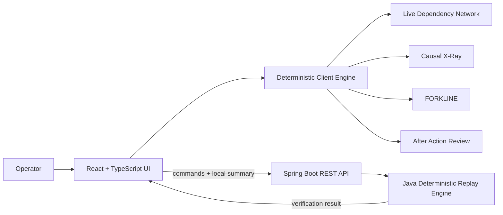

# CascadeTrace

**Critical Infrastructure Cascade Simulator · CITY//01**

A deterministic critical-infrastructure cascade simulator built as a **Java full-stack application** with a **Spring Boot verification API** and a **React + TypeScript operational interface**.

> **Every decision changes what happens next.**

CITY//01 begins with Substation S14 losing **180 MW** during peak demand. The player has a compressed 60-second response window to intervene across a dependency graph spanning Power, Telecom, Traffic, Water, Hospital, and Emergency Services.

> **Scope:** CascadeTrace is an engineering simulation and portfolio project. It is not intended to control or advise real critical infrastructure.

## What makes it different

CascadeTrace is not an LLM dashboard. The simulation is deterministic and auditable:

- **Deterministic engine** — identical commands at identical times reproduce the same outcome.
- **Live dependency network** — system states and propagation paths update from simulation state.
- **Decision debt** — an intervention can solve the immediate problem while creating delayed consequences.
- **Causal X-Ray** — threshold crossings are explained using recorded provenance.
- **FORKLINE** — replay a decision branch and compare alternate outcomes.
- **After Action Review** — evidence-based final deficit, cascade events, recovery, completed decisions, verified intelligence, and debt.
- **Independent Java replay verification** — the Spring Boot backend replays the client command sequence and verifies the final deterministic summary.
- **Replay fingerprints** — verified runs receive a deterministic SHA-256 fingerprint derived from the command ledger and server outcome.

## Tech stack

### Backend
- Java 17
- Spring Boot 3
- Spring Web / REST APIs
- Jakarta Validation
- JUnit 5
- Maven

### Frontend
- React 18
- TypeScript
- Vite
- SVG dependency visualization
- CSS responsive design / reduced-motion support

### Delivery
- Docker / Docker Compose
- Nginx
- GitHub Actions CI

## Architecture



The client engine owns interactive, frame-by-frame simulation so the UI remains responsive. At scenario completion, the same command ledger is independently replayed by Java. The backend returns whether the server replay matches the client's first stress/degradation, recovery time, and final power deficit.

## Scenario

**Initial incident:** Substation S14 loses 180 MW.

**Systems:**
- Power
- Telecom
- Traffic
- Water
- Hospital
- Emergency Services

**Interventions:**
1. Reroute Grid Capacity
2. Shed Non-Critical Load
3. Deploy a Mobile Generator
4. Prioritize Emergency Telecom Traffic
5. Verify an Uncertain Field Report
6. Dispatch a Repair Team

## Deterministic reference trajectories

| Strategy | First STRESSED | First DEGRADED | Recovery | Final deficit |
|---|---:|---:|---:|---:|
| No Action | 40s | 185s | — | 120 MW |
| Reroute | 76s | — | — | 40 MW |
| Reroute + Mobile | — | — | 40s | 0 MW |
| Shed Load | 180s | 198s | — | 30 MW |

Shed Load also creates a delayed Telecom backup-depletion condition at 180s.

## Run locally

### 1. Backend

```bash
cd backend
mvn spring-boot:run
```

The API starts at `http://localhost:8080`.

### 2. Frontend

```bash
cd frontend
npm install
npm run dev
```

Open `http://localhost:5173`.

The frontend automatically uses `http://localhost:8080/api/v1` unless `VITE_API_BASE_URL` is set.

## Run with Docker

```bash
docker compose up --build
```

Open `http://localhost:8081`.

## Verification

Frontend deterministic suites:

```bash
cd frontend
npm run verify
npm run build
```

Expected:

- Engine: **39/39 PASS**
- Replay: **13/13 PASS**
- Causal: **14/14 PASS**
- FORKLINE: **11/11 PASS**

Backend:

```bash
cd backend
mvn test
```

The Java tests assert the same four reference trajectories.

## REST API

### Health

`GET /api/v1/health`

### Scenario metadata

`GET /api/v1/scenario`

### Replay verification

`POST /api/v1/replay`

Example request:

```json
{
  "commands": [
    { "second": 0, "commandId": "reroute", "insertionOrder": 0 },
    { "second": 0, "commandId": "mobile", "insertionOrder": 1 }
  ],
  "clientSummary": {
    "firstStressed": null,
    "firstDegraded": null,
    "recoveryTime": 40,
    "finalDeficit": 0
  }
}
```

The API replays the command sequence and sets `verified=true` only when its deterministic summary matches the client summary. It also returns a deterministic `fingerprint` for the replay.

## Repository layout

```text
CascadeTrace/
├── backend/                 # Java + Spring Boot verification API
├── frontend/                # React + TypeScript simulator
├── docs/                    # Architecture and API notes
├── .github/workflows/       # CI
├── docker-compose.yml
└── README.md
```

## Design principle

The simulator intentionally separates **presentation time** from **authoritative simulation time**: 420 deterministic engine seconds are played at 7× speed and displayed to the user as a 60-second incident. This keeps the tested scenario trajectories intact while making the interaction practical.


## Engineering decisions

See [`docs/architecture.md`](docs/architecture.md) for the runtime model and [`docs/adr/0001-deterministic-simulation.md`](docs/adr/0001-deterministic-simulation.md) for the deterministic-engine decision.

## License

Apache License 2.0. See [`LICENSE`](LICENSE).
