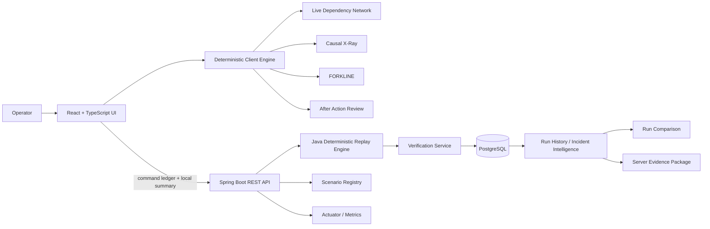

# CascadeTrace

**Critical Infrastructure Cascade Simulator · CITY//01**

CascadeTrace is a deterministic critical-infrastructure incident simulator built as a **Java full-stack application** with a **Spring Boot backend**, **PostgreSQL persistence**, and a **React + TypeScript operational interface**.

> **Every decision changes what happens next.**

CITY//01 begins with Substation S14 losing **180 MW** during peak demand. The operator has a compressed 60-second response window to intervene across a dependency graph spanning Power, Telecom, Traffic, Water, Hospital, and Emergency Services.

> **Scope:** CascadeTrace is an engineering simulation and portfolio project. It is not intended to control or advise real critical infrastructure.

## What makes it different

CascadeTrace is not an LLM dashboard. The simulation is deterministic, replayable, persistent, and auditable:

- **Deterministic engine** — identical commands at identical times reproduce the same outcome.
- **Live dependency network** — system states and propagation paths update from authoritative simulation state.
- **Decision debt** — an intervention can solve the immediate problem while creating delayed consequences.
- **Causal X-Ray** — threshold crossings are explained using recorded provenance.
- **FORKLINE** — replay a decision branch and compare alternate outcomes.
- **After Action Review** — evidence-based deficit, cascades, recovery, completed decisions, verified intelligence, and debt.
- **Independent Java replay verification** — Spring Boot replays the exact client command ledger and verifies the final deterministic summary.
- **Persistent incident archive** — completed runs and command ledgers are stored in PostgreSQL through Spring Data JPA.
- **Replay fingerprints** — each replay receives a deterministic SHA-256 fingerprint derived from the command ledger and server outcome.
- **Server re-verification** — any archived run can be replayed again against the current deterministic Java engine.
- **Run comparison** — select two archived incidents and compare outcome deltas plus command-ledger differences.
- **Archive intelligence** — PostgreSQL-backed run count, verification count, average deficit, best deficit, recovery count, debt count, and average command count.
- **Versioned scenario registry** — scenario metadata is exposed through a stable catalog contract with a deterministic manifest hash.
- **Server evidence packages** — archived runs can be exported from the backend with the scenario manifest, exact command ledger, replay result, replay fingerprint, and a package-level SHA-256 integrity hash.
- **Request traceability** — every API request receives an `X-Correlation-ID` and backend logs include the same correlation identifier.
- **Operational metrics** — Spring Boot Actuator exposes counters for recorded, verified, mismatched, and re-verified runs.

## Tech stack

### Backend
- Java 17
- Spring Boot 3
- Spring Web / REST APIs
- Spring Data JPA / Hibernate
- PostgreSQL
- Flyway migrations
- Jakarta Validation
- Spring Boot Actuator / Micrometer
- Springdoc OpenAPI / Swagger UI
- JUnit 5 + H2 PostgreSQL-mode integration tests
- Maven

### Frontend
- React 18
- TypeScript
- Vite
- SVG dependency visualization
- Responsive CSS / reduced-motion support
- Persistent Run History / Incident Intelligence interface

### Delivery
- Docker / Docker Compose
- Nginx
- GitHub Actions CI
- Windows one-click launcher and environment doctor
- macOS/Linux one-command launcher and environment doctor

## Architecture



The browser owns the interactive frame-by-frame simulation so the UI stays responsive. At scenario completion, the same command ledger is independently replayed by Java. The backend verifies the client's stress/degradation timing, recovery, and final deficit, then persists the evidence and replay fingerprint.

## Scenario registry

CascadeTrace 1.3 introduces a registry boundary so scenario identity is no longer spread across controllers and UI code. CITY//01 remains the operational simulation, while the registry contract is ready for additional deterministic scenarios without changing archive or evidence APIs.

Each manifest contains:

- canonical scenario ID and key
- display title and operational status
- deterministic engine version
- authoritative and presentation duration
- incident loss
- systems and interventions
- scenario tags
- deterministic SHA-256 manifest hash

The manifest hash changes when authoritative scenario metadata changes, giving exported evidence a stable scenario identity.

## Scenario

**Initial incident:** Substation S14 loses 180 MW.

**Systems:** Power, Telecom, Traffic, Water, Hospital, Emergency Services.

**Interventions:**
1. Reroute Grid Capacity
2. Shed Non-Critical Load
3. Deploy a Mobile Generator
4. Prioritize Emergency Telecom Traffic
5. Verify an Uncertain Field Report
6. Dispatch a Repair Team

## Deterministic reference trajectories

| Strategy | First STRESSED | First DEGRADED | Recovery | Final deficit |
|---|---:|---:|---:|---:|
| No Action | 40s | 185s | — | 120 MW |
| Reroute | 76s | — | — | 40 MW |
| Reroute + Mobile | — | — | 40s | 0 MW |
| Shed Load | 180s | 198s | — | 30 MW |

Shed Load also creates a delayed Telecom backup-depletion condition at 180s.

## One-step run on Windows

Prerequisite: **Docker Desktop**.

After cloning the repository, double-click:

```text
RUN-CASCADETRACE.bat
```

The launcher starts the entire stack, waits for frontend and backend readiness, and opens the simulator. You do **not** need separate PowerShell windows for frontend, backend, or PostgreSQL.

To stop all services while preserving PostgreSQL data, double-click:

```text
STOP-CASCADETRACE.bat
```

To diagnose the machine before starting, double-click:

```text
CHECK-CASCADETRACE.bat
```

Advanced launcher options:

```powershell
.\run.ps1 -NoBuild      # reuse existing Docker images
.\run.ps1 -OpenArchive  # open the incident archive directly
.\run.ps1 -NoBrowser    # start services without opening a browser
.\run.ps1 -ResetData    # rebuild from a clean PostgreSQL volume
```

`-ResetData` intentionally deletes the local CascadeTrace PostgreSQL Docker volume.

## One-step run on macOS / Linux

Prerequisites: Docker with Compose v2 and `curl`.

```bash
./check.sh
./run.sh
```

Stop the stack with:

```bash
./stop.sh
```

The Unix launcher reuses an already-running healthy stack, waits for backend and frontend readiness, prints diagnostics on failure, and opens the simulator when a desktop opener is available.

## Run with Docker

```bash
docker compose up --build -d
```

Open:

- Simulator: `http://localhost:8081`
- Incident archive: `http://localhost:8081/history.html`
- API health: `http://localhost:8080/actuator/health`
- Swagger UI: `http://localhost:8080/swagger-ui.html`
- Metrics index: `http://localhost:8080/actuator/metrics`

PostgreSQL data is retained in the `cascadetrace-postgres` Docker volume.

## Run locally

### 1. Start PostgreSQL

```bash
docker compose up -d db
```

Default development connection:

```text
jdbc:postgresql://localhost:5432/cascadetrace
username: cascadetrace
password: cascadetrace
```

You can override it with `DATABASE_URL`, `DATABASE_USERNAME`, and `DATABASE_PASSWORD`.

### 2. Backend

```bash
cd backend
mvn spring-boot:run
```

### 3. Frontend

```bash
cd frontend
npm install
npm run dev
```

## Verification

Frontend deterministic suites:

```bash
cd frontend
npm run verify
npm run build
```

Expected:

- Engine: **39/39 PASS**
- Replay: **13/13 PASS**
- Causal: **14/14 PASS**
- FORKLINE: **11/11 PASS**

Backend:

```bash
cd backend
mvn test
```

Backend tests cover deterministic replay, persistence/re-verification, archive statistics, stored-run comparison, scenario manifests, and stable server-generated evidence packages.

Delivery contracts are also validated in CI:

```bash
docker compose config --quiet
bash -n run.sh stop.sh check.sh
```

## REST API

### Runtime APIs

- `GET /api/v1/health`
- `GET /api/v1/scenario` — compatibility endpoint for CITY//01 metadata
- `POST /api/v1/replay`

### Scenario registry APIs

- `GET /api/v1/scenarios` — scenario catalog
- `GET /api/v1/scenarios/{id}` — versioned scenario manifest and manifest hash

Both `CITY01` and `CITY//01` resolve to the same canonical scenario manifest.

### Persistent run APIs

- `GET /api/v1/runs?page=0&size=20` — newest runs first
- `GET /api/v1/runs/stats` — archive-level aggregate metrics
- `GET /api/v1/runs/compare?left=<uuid>&right=<uuid>` — deterministic stored-run comparison; deltas are `RIGHT - LEFT`
- `GET /api/v1/runs/{id}` — run evidence + command ledger
- `GET /api/v1/runs/{id}/evidence` — server-generated evidence package with package-level integrity hash
- `POST /api/v1/runs/{id}/verify` — replay and re-verify an archived run

Every API response includes an `X-Correlation-ID`. Clients may provide their own correlation ID header; otherwise the backend generates one.

## Evidence contract

The archive no longer builds its export package only in the browser. `GET /api/v1/runs/{id}/evidence` binds together:

```text
Evidence package v1.0
├── export timestamp
├── versioned scenario manifest
│   └── manifest SHA-256
├── persisted run identity
├── exact ordered command ledger
├── client summary
├── independent Java replay result
├── replay fingerprint
└── evidence-package SHA-256
```

The evidence hash intentionally excludes the export timestamp, so repeated exports of the same stored evidence produce the same integrity hash.

This is an integrity mechanism, not a digital signature or external attestation.

## Operational metrics

Actuator exposes standard JVM/application metrics plus CascadeTrace counters:

```text
cascadetrace.runs.recorded
cascadetrace.runs.verified
cascadetrace.runs.mismatch
cascadetrace.runs.reverified
```

## Persistence model

```text
simulation_runs
├── UUID id
├── scenario / timestamp
├── client summary
├── server replay outcome
├── verification state
├── SHA-256 replay fingerprint
└── optimistic-lock version

run_commands
├── run_id
├── simulation_second
├── command_id
├── optional report_id
└── deterministic insertion_order
```

Database changes are versioned with Flyway rather than generated automatically by Hibernate (`ddl-auto=validate`).

## Repository layout

```text
CascadeTrace/
├── backend/                 # Java + Spring Boot + JPA + PostgreSQL
├── frontend/                # React + TypeScript simulator + incident intelligence
├── docs/                    # Architecture and ADRs
├── .github/workflows/       # CI only; no bot-authored source commits
├── RUN-CASCADETRACE.bat     # Windows one-click launcher
├── STOP-CASCADETRACE.bat    # Windows one-click shutdown
├── CHECK-CASCADETRACE.bat   # Windows environment doctor
├── run.ps1                  # Windows launcher implementation
├── doctor.ps1               # Windows diagnostics
├── run.sh                   # macOS/Linux one-command launcher
├── stop.sh                  # macOS/Linux shutdown
├── check.sh                 # macOS/Linux environment doctor
├── docker-compose.yml
└── README.md
```

## Design principle

The simulator separates **presentation time** from **authoritative simulation time**: 420 deterministic engine seconds are played at 7× speed and displayed as a 60-second incident. This keeps the tested trajectories intact while making the interaction practical.

## Engineering decisions

See [`docs/architecture.md`](docs/architecture.md), [`docs/adr/0001-deterministic-simulation.md`](docs/adr/0001-deterministic-simulation.md), and [`docs/adr/0002-scenario-registry-and-evidence-contracts.md`](docs/adr/0002-scenario-registry-and-evidence-contracts.md).

## Maintainer

**BackendArchitectX**

## License

Apache License 2.0. See [`LICENSE`](LICENSE).
