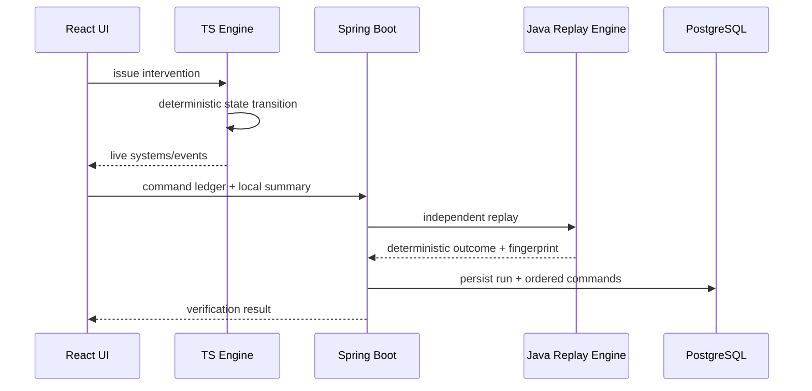

# Architecture

## Runtime boundaries

### React / TypeScript
The browser runs the interactive CITY//01 simulation. It owns the live state required for graph rendering, intervention controls, event history, Causal X-Ray, FORKLINE, and the After Action Review.

The browser deliberately does **not** wait on the backend for every deterministic tick. This keeps incident playback responsive and preserves the tested client simulation semantics.

### Spring Boot
The Java service is an independent deterministic verifier and incident-evidence service. At the end of a run it receives the recorded command ledger plus a compact local summary, performs its own replay, verifies parity, fingerprints the replay, and persists the resulting evidence.

The backend also provides:

- archived-run retrieval and re-verification;
- archive-level statistics;
- deterministic comparison of two persisted runs;
- request correlation IDs;
- Actuator health and Micrometer metrics;
- OpenAPI / Swagger documentation.

### PostgreSQL
PostgreSQL is the durable source for completed-run evidence. Flyway owns the schema lifecycle and Hibernate runs with `ddl-auto=validate`, so application startup fails if the entity model and schema drift apart.

Persisted data includes:

- run identity and scenario;
- client summary;
- independent Java replay outcome;
- verification state;
- SHA-256 replay fingerprint;
- ordered command ledger;
- optimistic-lock version.

Indexes cover archive ordering, verification filtering, command-ledger lookup, fingerprint deduplication, and scenario/time access paths.

## Request flow

## Incident intelligence

The archive exposes two layers of evidence:

1. **Individual run evidence** — exact command ledger, client summary, Java replay result, verification state, and fingerprint.
2. **Cross-run evidence** — right-minus-left deltas for deficit, cascade count, recovery timing, threshold timing, command count, and commands unique to each run.

Comparison is calculated from persisted authoritative replay results rather than from synthetic scoring.

Archive statistics are calculated in PostgreSQL using aggregate queries instead of loading all runs into application memory.

## Determinism

Simulation transitions depend only on:

- initial CITY//01 seed/state;
- command ID;
- command issue second;
- insertion order for simultaneous commands;
- selected report where relevant.

There is no random number source in the simulation engine.

## Causal provenance

Threshold events record:

- source system;
- target system;
- affected metric;
- previous/new value;
- cause ID;
- authoritative simulation time.

Causal X-Ray renders these fields rather than generating an explanation from an LLM.

## Replay identity

A SHA-256 replay fingerprint is derived from the deterministic command ledger and replay outcome. The fingerprint is persisted with the run and can be copied or exported from the archive UI.

The replay endpoint suppresses identical fingerprints recorded within a short window so React development-mode duplicate submissions do not create duplicate incident records.

## Observability

Every HTTP request receives an `X-Correlation-ID`. If a client sends a valid correlation ID it is preserved; otherwise the API generates a UUID. The same value is placed in the logging MDC for request-level traceability.

Actuator exposes health and metrics. CascadeTrace-specific counters include:

- `cascadetrace.runs.recorded`
- `cascadetrace.runs.verified`
- `cascadetrace.runs.mismatch`
- `cascadetrace.runs.reverified`

## Local deployment

Docker Compose owns three services:

1. PostgreSQL
2. Spring Boot API
3. Nginx-hosted React application

The Windows launcher wraps Compose so the entire stack starts with `RUN-CASCADETRACE.bat`. It waits for backend and frontend readiness before opening the browser, reuses an already-running stack, and prints service diagnostics when startup fails.

## Design trade-off

The browser remains the live simulation authority while Java acts as an independent replay authority for persisted evidence. This duplicates a small amount of deterministic logic intentionally: disagreement becomes observable instead of silently trusting one implementation.
